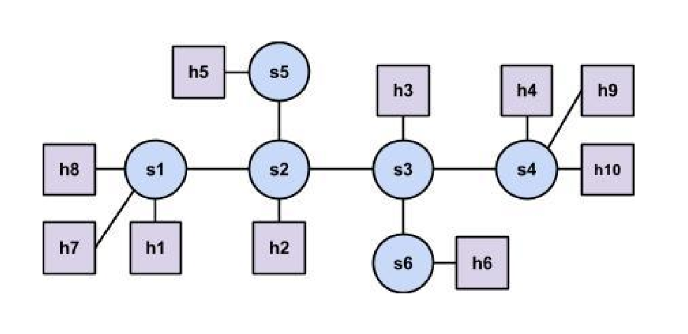
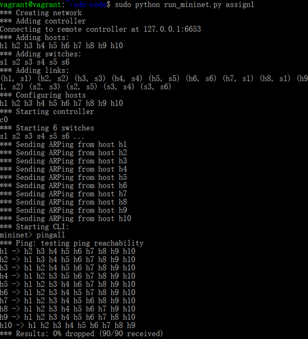

## A Simple SDN Controller Based on Ryu and Mininet

**This is the second optional project of the final projects for CS305 Computer Network, SUSTech.**

### Project Details

See :[Project Details](./project_requirement/proj_sdn.pdf)

### Environment

The environment establish requires a Virtual Machine. Vagrant on Ubuntu 16.04 is recommend. For details about environment establish, see: [Tutorial Establish](./project_requirement/SDN_project-Tutorial_on_Environment_Set-Up.pdf)

### Usage

Use

```bash
sh startup_ryu.sh
```

to initiate Ryu, then use

```bash
python run_mininet.py assign1
```

to run `assign1` network. Some template networks are already provided in `run_mininet.py`.

Assign1:



Result:



